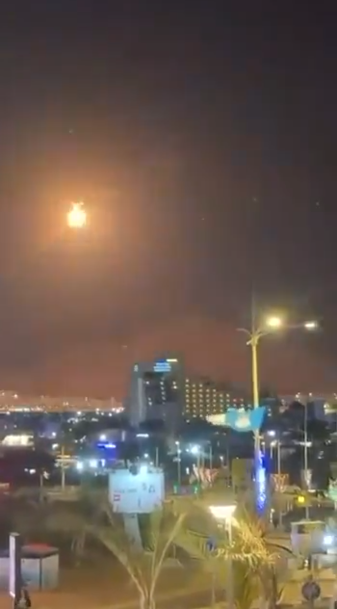
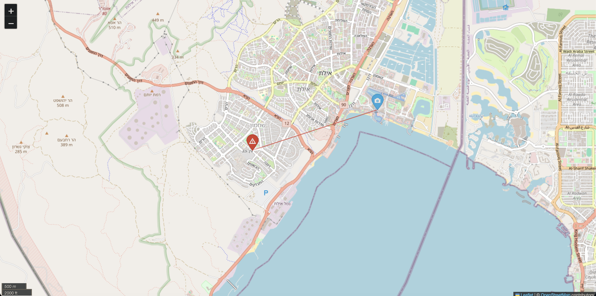

# Detonation Mapper

`Detonation Mapper` analyzes a short MP4 clip, detects one or more explosion events, estimates the delay between the flash and boom, converts that delay to distance using the speed of sound, and can optionally render estimated locations on an interactive HTML map.

## Features

- OpenCV-based frame scanning for flash, motion, and scene-change spikes
- MoviePy audio extraction from MP4 clips
- numpy/scipy audio transient detection using RMS energy and spectral-flux onset strength
- Support for multiple explosions in one clip
- Automatic visual/audio candidate pairing with configurable delay windows
- Optional geolocation from camera metadata and frame x-position
- Folium HTML map output with exact points or uncertainty sectors
- JSON and CSV export
- Debug plots and annotated frame export

## Installation

Python 3 is the target runtime.

```bash
python3 -m venv .venv
source .venv/bin/activate
pip install -r requirements.txt
```

If your local environment has trouble decoding MP4 audio/video, make sure FFmpeg is available.

## CLI Usage

Basic run:

```bash
python main.py --video clip.mp4
```

Full example with mapping:

```bash
python main.py \
  --video clip.mp4 \
  --temp-c 20 \
  --camera-lat 31.7 \
  --camera-lon 35.2 \
  --camera-azimuth 110 \
  --output-dir results/ \
  --output-json result.json \
  --output-csv result.csv \
  --output-map map.html \
  --debug-plots \
  --annotated-frames-dir annotated_frames
```

## Example Output

Example source screenshot:



Example map output:



Manual per-event x-positions:

```bash
python main.py --video clip.mp4 --event-x-positions 410,860
```

Manual exact bearings:

```bash
python main.py --video clip.mp4 --event-bearings 112.5,118.0
```

## What You Need To Run

Minimum required:

- `--video`: required, no default, the MP4 clip to analyze

Useful but optional for a basic run:

- `--temp-c`: optional, default `20`, ambient temperature in Celsius for distance calculation
- `--min-delay`: optional, default `0.1`, minimum plausible flash-to-boom delay in seconds
- `--max-delay`: optional, default `20.0`, maximum plausible flash-to-boom delay in seconds
- `--visual-threshold-z`: optional, default `2.5`, visual detection sensitivity
- `--audio-threshold-z`: optional, default `2.0`, audio detection sensitivity
- `--min-spacing`: optional, default `0.35`, minimum spacing used during initial peak detection

Needed for mapping:

- `--camera-lat`: optional in general, required only for map/geolocation output, default none
- `--camera-lon`: optional in general, required only for map/geolocation output, default none

Needed for directional point estimates instead of just distance:

- `--camera-azimuth`: optional, no default
- `--hfov`: optional, default `80.0`

Optional manual overrides:

- `--event-x-positions`: optional, default none, comma-separated per-event x pixel positions
- `--event-bearings`: optional, default none, comma-separated exact event bearings in degrees

Optional outputs:

- `--output-dir`: optional, default current directory. Base directory for all output files. Relative paths given to other output flags are resolved under this directory; absolute paths are used as-is.
- `--output-json`: optional, default none
- `--output-csv`: optional, default none
- `--output-map`: optional, default none, but requires `--camera-lat` and `--camera-lon`
- `--debug-plots`: optional flag, default off
- `--debug-dir`: optional, default `debug_plots`
- `--annotated-frames-dir`: optional, default none
- `--review-x-positions`: optional flag, default off

## Inputs

The CLI accepts:

Core input:

- `--video`: required, no default. Path to the MP4 clip. This is the only flag required for a basic detection-only run.
- `--temp-c`: optional, default `20`. Ambient temperature in Celsius. This changes the speed-of-sound estimate and therefore the computed distance. If you do not know the exact temperature, a nearby weather value is usually good enough.

Timing and detector tuning:

- `--min-delay`: optional, default `0.1`. Minimum plausible time between flash and boom in seconds. Raise this if you want to reject very near events or false matches that occur almost immediately after the flash.
- `--max-delay`: optional, default `20.0`. Maximum plausible time between flash and boom in seconds. Lower this if you know events are nearby; keep it higher if distant detonations are possible.
- `--visual-threshold-z`: optional, default `2.5`. Sensitivity of flash detection. Higher values produce fewer visual candidates; lower values make the detector more permissive.
- `--audio-threshold-z`: optional, default `2.0`. Sensitivity of boom detection. Higher values produce fewer audio candidates; lower values detect more weak transients but can increase false positives.
- `--min-spacing`: optional, default `0.35`. Minimum spacing, in seconds, during early peak detection. This helps prevent one flash or one boom from being split into many nearby candidates before the later merge logic runs.

Map and geolocation inputs:

- `--camera-lat`: optional, default none. Camera latitude in decimal degrees. Required if you want the tool to place events on a map.
- `--camera-lon`: optional, default none. Camera longitude in decimal degrees. Required if you want the tool to place events on a map.
- `--camera-azimuth`: optional, default none. Compass direction of the camera centerline in degrees. `0` is north, `90` is east, `180` is south, `270` is west. Used to turn an event's horizontal frame position into a map bearing.
- `--hfov`: optional, default `80.0`. Horizontal field of view in degrees. This should be the full left-to-right field of view of the camera, not half. Used together with `--camera-azimuth` and the event `x` position.

Manual overrides:

- `--event-x-positions`: optional, default none. Comma-separated per-event `x` pixel positions, in event order. Use this when the automatic horizontal source location is wrong and you want to improve map bearing.
- `--event-bearings`: optional, default none. Comma-separated exact per-event bearings in degrees. This bypasses x-position-derived bearing estimation and is useful when you know the true azimuth more accurately than the image-based estimate.

Interactive review:

- `--review-x-positions`: optional flag, default off. Opens an interactive frame picker after pairing so you can click a better horizontal position for each event.

Outputs:

- `--output-dir`: optional, default current directory. Base directory for all output files. Any relative path given to the flags below is resolved under this directory; absolute paths pass through unchanged.
- `--output-json`: optional, default none. Writes the full result payload, including candidates, pairings, and warnings, to JSON.
- `--output-csv`: optional, default none. Writes the final paired events to CSV. Useful for spreadsheet review or downstream analysis.
- `--output-map`: optional, default none. Writes an HTML map. Requires `--camera-lat` and `--camera-lon`.
- `--debug-plots`: optional flag, default off. Saves visual/audio debug plots so you can inspect why candidates were chosen.
- `--debug-dir`: optional, default `debug_plots`. Directory where debug plots are written when `--debug-plots` is enabled.
- `--annotated-frames-dir`: optional, default none. Exports still frames for matched events with the detected event position drawn on the image.

## How It Works

### Visual detection

For each frame, the tool computes:

- grayscale mean brightness
- frame-to-frame absolute difference
- motion fraction from changed pixels

These are normalized, combined into a spike score, and passed through peak detection to produce candidate visual event timestamps.

### Audio detection

The tool:

- extracts the MP4 audio track with MoviePy
- converts to mono
- computes RMS energy and a spectral-flux onset strength
- combines those scores
- uses scipy peak detection to produce candidate audio boom timestamps

### Pairing

For each visual event, the program chooses the earliest unmatched plausible audio event after it, subject to the configured delay window.

Distance is then estimated as:

```text
speed_of_sound = 331.3 + 0.606 * temp_c
distance_m = delay_sec * speed_of_sound
```

### Mapping

If camera coordinates are present:

- exact bearings produce exact destination points
- camera azimuth plus x-position plus HFOV produces an estimated bearing
- camera azimuth without exact x-position does not pretend precision; the map shows uncertainty instead of a precise point when possible

## Output

The JSON output includes:

- clip duration
- video FPS
- audio sample rate
- candidate visual event count
- candidate audio event count
- final pairings
- warning count

Each final event includes:

- `event_id`
- `visual_time_sec`
- `audio_time_sec`
- `delay_sec`
- `distance_m`
- `distance_km`
- `bearing_deg` when available
- `estimated_lat` / `estimated_lon` when available
- `confidence`
- notes

## Tests

Run:

```bash
pytest
```

The test suite covers:

- speed of sound formula
- distance calculation
- pairing logic
- bearing estimation from x-position and HFOV
- destination point calculation
- edge cases such as no audio, no visual events, and overlapping events

## Limitations and Uncertainty

- Flash detection can be confused by lightning, headlights, sudden exposure changes, or cuts.
- Audio boom detection can be confused by other short transients.
- Automatic pairing is heuristic and can be wrong when multiple events overlap closely.
- Distance assumes still air and a simple speed-of-sound model.
- Mapping accuracy depends heavily on camera coordinates, azimuth calibration, HFOV accuracy, and correct event x-position.
- If bearing inputs are incomplete, the tool surfaces uncertainty instead of inventing a precise location.
